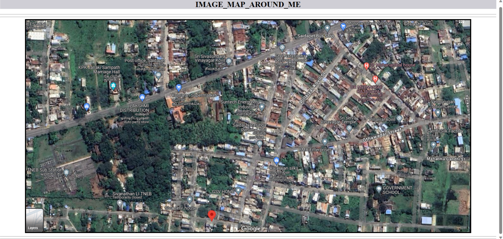

# Places Around Me
# Aim:
To develop a website to display details about the places around my house.

# Design Steps:
## Step 1
use the image tag to upload the required photo by source
## Step 2
create a map name MAGE_MAP_AROUND_ME, By using the shape attribute to select a particular place to show the information
## Step 3
By using the coords attribute we can select a particular area we needed ,Then using the href the website is called to show the details.

# Code:

<!DOCTYPE html>
<html>
<head>
    <title>IMAGE_MAP_AROUND_ME</title>
</head>
<body align="center">
    <h1 ALIGN="center">IMAGE_MAP_AROUND_ME</h1>
    

    

    

  <area alt="GOVERNMENT SCHOOL" title="GOVERNMENT SCHOOL" href="https://www.google.com/maps/place/GOVERNMENT+SCHOOL+BALAJINAGAR/@12.6673253,79.268615,1720m/data=!3m1!1e3!4m6!3m5!1s0x3bad29f0dc83565d:0xfa4a605b87e4bfd!8m2!3d12.6633143!4d79.2742264!16s%2Fg%2F11lfppnb65?entry=ttu" coords="1418,688,1486,772" shape="rect">
  <area alt="TNEB Sub Station" title="TNEB Sub Station" href="https://www.google.com/maps/place/TNEB+Sub+Station/@12.6635862,79.267657,430m/data=!3m1!1e3!4m6!3m5!1s0x3bad2947405a0875:0x8c209f97bf738187!8m2!3d12.6635862!4d79.2689444!16s%2Fg%2F11f32cv8jh?entry=ttu" coords="126,626,207,684" shape="rect">
  <area alt="K P K Janaki Sampath Marriage Hall" title="K P K Janaki Sampath Marriage Hall" href="https://www.google.com/maps/place/K+P+K+Janaki+Sampath+Marriage+Hall/@12.6648488,79.269733,215m/data=!3m1!1e3!4m6!3m5!1s0x3bad2947086fc05d:0x15ef4149b4036759!8m2!3d12.6650592!4d79.2697316!16s%2Fg%2F1tdq900f?entry=ttu" coords="329,225,381,329" shape="rect">
  <area alt="Sri Sivasundara Vinayagar Kovil" title="Sri Sivasundara Vinayagar Kovil" href="https://www.google.com/maps/place/Sri+Sivasundara+Vinayagar+Kovil/@12.664724,79.2698061,310m/data=!3m1!1e3!4m6!3m5!1s0x3bad29465faa870f:0xe0e38e218d74deed!8m2!3d12.6654292!4d79.2716916!16s%2Fg%2F11dfwyh15h?entry=ttu" coords="772,154,826,189" shape="rect">
  <area alt="Post office, Saidapet" title="Post office, Saidapet" href="https://www.google.com/maps/place/Post+office,+Saidapet/@12.664724,79.2698061,310m/data=!3m1!1e3!4m6!3m5!1s0x3bad29671abc61c7:0xcf0fe3827305518c!8m2!3d12.6651956!4d79.270479!16s%2Fg%2F11fl9l4tpb?entry=ttu" coords="514,217,552,259" shape="rect">
</map>

</body>
</html>

# Output:
